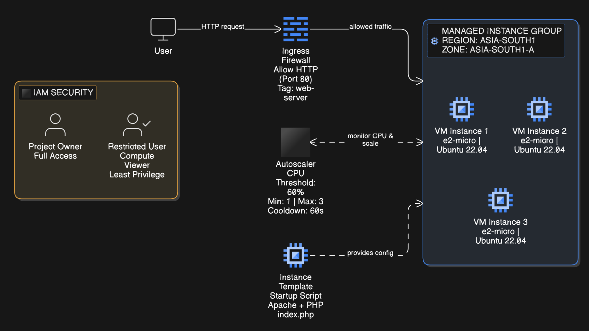

# VCC Assignment 2 – GCP to Create a VM to Leverage Auto Scaling and Security

## Objective

This project demonstrates the creation of a Virtual Machine on Google Cloud Platform (GCP) with:
- Managed Instance Group (MIG)
- CPU-based Auto Scaling
- IAM Role-Based Access Control
- Firewall Security Configuration

The implementation showcases Infrastructure-as-a-Service (IaaS) capabilities and cloud elasticity.

## Cloud Environment Details

- Cloud Platform: Google Cloud Platform (GCP)
- Region: asia-south1 (Mumbai)
- Zone: asia-south1-a
- Machine Type: e2-micro
- OS: Ubuntu 22.04 LTS
- Boot Disk: 10GB Balanced Persistent Disk

## Architecture Overview

The system architecture consists of:
- A Managed Instance Group (MIG)
- Instance Template with startup script
- CPU-based Autoscaler
- Firewall rules for traffic control
- IAM roles for restricted access

## Architecture Diagram

## Deployment Summary

1. Created a Base VM using Compute Engine.
2. Developed a startup script to install Apache and PHP.
3. Created an Instance Template similar to Base VM with startup script.
4. Created a Managed Instance Group, which uses the Instance Template.
5. Enabled CPU-based Autoscaling for the Instance Group.
6. Configured Firewall rules for Instance Group.
7. Applied IAM restricted access roles.

## Autoscaling Configuration

- Metric: CPU Utilization
- Target CPU Utilization: 60%
- Minimum Instances: 1
- Maximum Instances: 3
- Initialization Period: 60 seconds

When CPU utilization exceeded 60%, a new VM instance was automatically created within approximately 1–2 minutes. While, after CPU load decreased, additional instances were removed automatically.

## Security Implementation

### IAM

- Project Owner: Administrator account
- Restricted User Role: Compute Viewer
- Principle applied: Least Privilege

Restricted users can view resources of compute engine but cannot modify or delete them.

### Firewall

- HTTP (Port 80) allowed
- HTTPS (Port 443) allowed
- SSH (Port 22) restricted to specific public IP
- Custom Firewall Rule to allow only the VM instances with web-server tag to get HTTP traffic

## Key Concepts Demonstrated

- Infrastructure as Code (Startup Script)
- Managed Cloud Infrastructure
- Elastic Scaling
- Role-Based Access Control
- Network-Level Security

### Name: Shrusti Jain  
### Roll No: M25CSE030  
